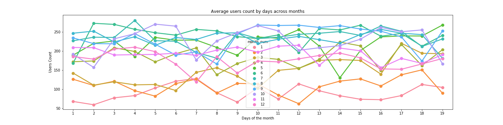
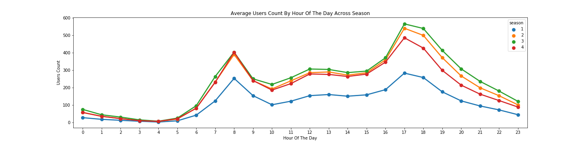
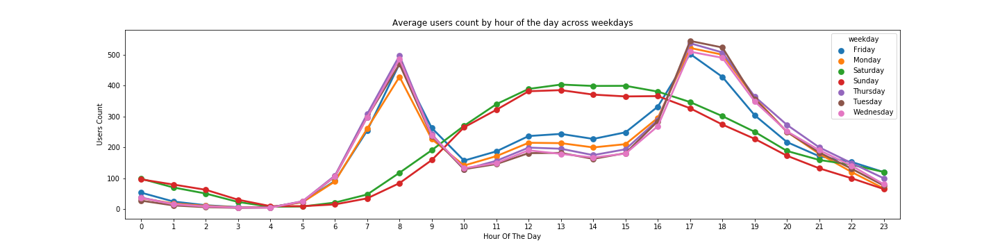
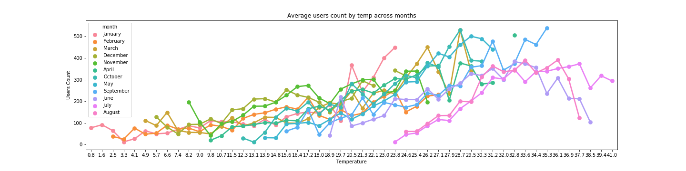
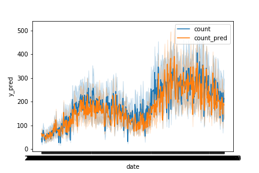
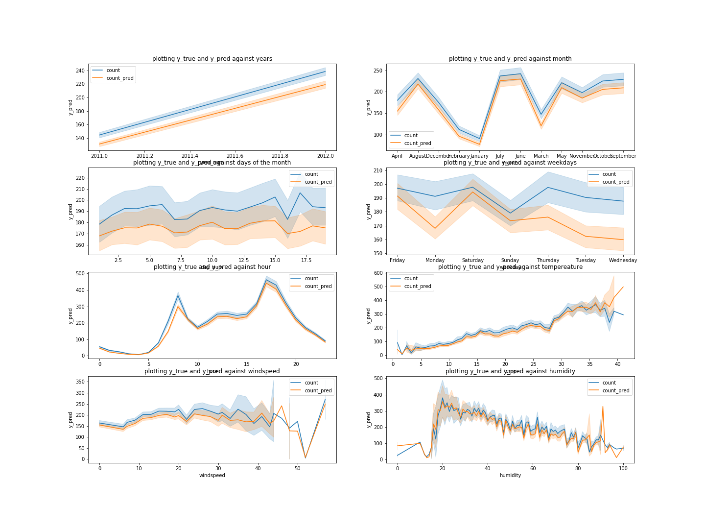

# Bike sharing demand predictions

### Description
- Kaggle competition on bike sharing systems are a means of renting bicycles where the process of obtaining membership, rental, and bike return is automated via a network of kiosk locations throughout a city. Using these systems, people are able rent a bike from a one location and return it to a different place on an as-needed basis. Currently, there are over 500 bike-sharing programs around the world
- My focus for this project was to build and train a linear regression model on the Capital Bike Share (Washington, D.C.) Kaggle data set, in order to predict demand for bicycle rentals at any given hour, based on time- and weather-related features

### The Challenge
- The data generated by these systems makes them attractive for researchers because the duration of travel, departure location, arrival location, and time elapsed is explicitly recorded
- Bike sharing systems therefore function as a sensor network, which can be used for studying mobility in a city
- In this competition, participants are asked to combine historical usage patterns with weather data in order to forecast bike rental demand in the Capital Bikeshare program in Washington, D.C.
- Models are evaluated based on the RMSLE (Root Mean Squared Logarithmic Error)

### Links and data files
- Join the kaggle competition [here](https://www.kaggle.com/c/bike-sharing-demand/overview)
- Train and test data file can be found [here](https://www.kaggle.com/c/bike-sharing-demand/data)

### Core Technical Concept
1. file [bike_data_exploration] focusses on review of the training set and visually exploring the raw data to find correlations
2. file [bike_machine_learning] follows a machine learning workflow to
(A) feature engineer the data, (B) train the model, (C) test the model and (D) upload a data set to kaggle

____________

### Example result outputs
Exploring the data

Average user count by days across months

Average user count by hour of day across season

Average user count by hour across weekdays

Average user count by temp across months

Plot training data y_true vs y_pred user count

Plot training data against true x values year, month, day, weekday, hour temp, windspeed, humidity

