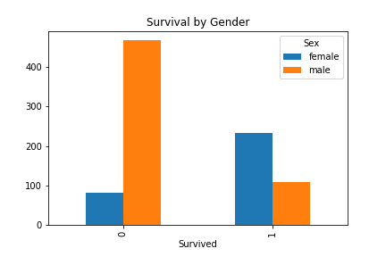
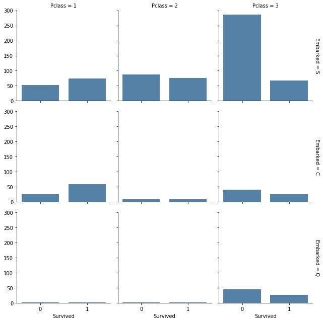
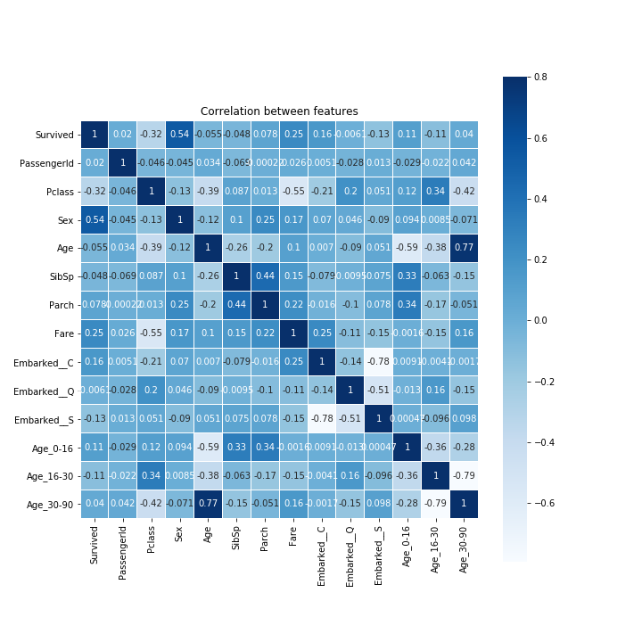
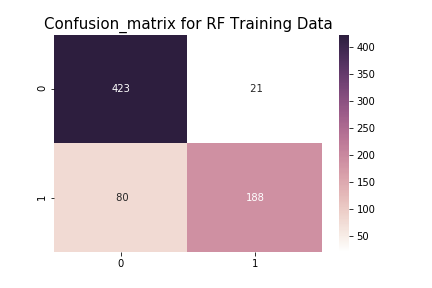
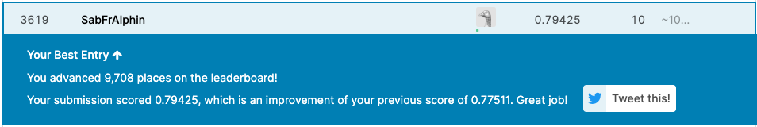

# Titanic Survival competition

### Description
- This is the legendary Titanic ML competition on the Kaggle platform. The competition is simple: use machine learning to create a model that predicts which passengers survived the Titanic shipwreck
- My focus for this project was to employ a logistic regression model and later improve the model by trialing a random forest and hyperparameter optimization for these

### The Challenge
- The sinking of the Titanic is one of the most infamous shipwrecks in history
- On April 15, 1912, during her maiden voyage, the widely considered “unsinkable” RMS Titanic sank after colliding with an iceberg. Unfortunately, there weren’t enough lifeboats for everyone onboard, resulting in the death of 1502 out of 2224 passengers and crew
- While there was some element of luck involved in surviving, it seems some groups of people were more likely to survive than others
- In this challenge, I build a predictive model that answers the question: “what sorts of people were more likely to survive?” using passenger data (ie name, age, gender, socio-economic class, etc)

### Links and data files
- Join the kaggle competition [here](https://www.kaggle.com/c/titanic)
- Train and test data file can be found [here](https://www.kaggle.com/c/titanic/data)

### Core Technical Concept
1. file [titanic_data_exploration] focusses on review of the training set and visually exploring the raw data to find correlations
2. file [titanic_machine_learning] follows a machine learning workflow to
(A) feature engineer the data, (B) train the model, (C) test the model and (D) upload a data set to kaggle

____________

### Example result outputs
Exploring the data

**Survival by Gender on the titanic**

**Survival by port of embarkation and age**

**Feature Correlation for model preparation**

**Random Forest confusion matrix**

**Final kaggle score 0.79425**

